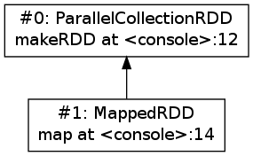
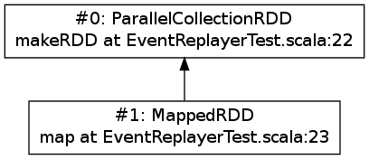

Spark Replay Debugger Overview
==============================

:Author: Cheng Lian <rhythm.mail@gmail.com>
:Date: 2013/12/01

.. contents::

Introduction
------------

This document provides a design overview and a simple usage description of the Spark Replay Debugger (abbreviated as SRD below).  For impatient readers that are only interested in how to use SRD, please jump to the `Usage`_ section.

The Spark debugger was first mentioned as ``rddbg`` in the `RDD technical report`__:

__ http://www.cs.berkeley.edu/~matei/papers/2011/tr_spark.pdf

.. pull-quote::

    Finally, we have taken advantage of the deterministic nature of RDDs to build ``rddbg``, a debugging tool for Spark that lets users rebuild any RDD created during a job using its lineage and re-run tasks on it in a conventional debugger.

    ...

    We stress that rddbg is not a full replay debugger: in particular, it does not replay nondeterministic code or behavior. However, it is useful for finding logic bugs as well as performance bugs where one task is consistently slow (e.g., due to skewed data or unusual input).

`Arthur`__, authored by `Ankur Dave`__, is an old implementation of the Spark debugger.  Unfortunately, the corresponding GitHub branch was not merged into the master branch and had stopped 2 years ago.  For more information about Arthur, please refer to the `Spark Debugger`__  Wiki page in the `old GitHub repository`__.

__ https://github.com/mesos/spark/tree/arthur
__ https://github.com/ankurdave
__ https://github.com/mesos/spark/wiki/Spark-Debugger
__ https://github.com/mesos/spark

Arthur is useful in both Spark job debugging and analyzing.  For example, it provides a nifty visualization feature powered by GraphViz, which can visualize the RDD lineage DAG of any given job.  The RDD technical report also provided interesting use cases.

The motivation of SRD is to complete this useful tool, and provide a basic mechanism upon which more sophisticated interactive debugging/analytics tools can be built.

Features
~~~~~~~~

Features already implemented in SRD includes:

#.  RDD lineage DAG visualization (with source location information)

    RDD lineage DAG visualization is based on GraphViz.  All output formats supported by GraphViz are also supported.

#.  Debugging assertions

    Debugging assertions can be considered as additional invariant checking closures attached to given RDDs.  Users can attach them to RDDs reconstructed from the event log or use them directly within their Spark applications.  When RDDs with assertions are computed, ``AssertionError`` exceptions would be thrown if the assertions fail.

    Currently SRD provides two types of debugging assertions:

    *   Forall-assertion

        Similar to Scala's ``Seq.forall`` predicate.  It applies a predicate closure of type ``T => Boolean`` and checks whether all elements within the RDD conforms to the predicate.

    *   Exists-assertion

        Similar to Scala's ``Seq.exists`` predicate.  It applies a predicate closure of type ``T => Boolean`` and checks whether there exists at least one element within the RDD that conforms the predicate.

    More assertion types are planned to be supported in the future.

Missing features
~~~~~~~~~~~~~~~~

Current SRD implementation is considered to be a preview of the basic mechanism.  Some features existed in Arthur are still missing, including:

#.  Checksum based transformation nondeterminism detection
#.  Individual task debugging with conventional debugger (``jdb`` for example)

However, with the help of the current SRD framework, these features can be easily implemented soon.  Please refer to the `Arthur Wiki page`__ for details about these two features.

__ https://github.com/mesos/spark/wiki/Spark-Debugger

Usage
-----

You may checkout the ``replay-debugger`` branch from GitHub::

    $ ssh clone git@github.com:liancheng/incubator-spark.git
    $ git checkout replay-debugger git@github.com:liancheng/incubator-spark.git

Or add a new remote to your existing local repository::

    $ git remote add liancheng
    $ git fetch liancheng
    $ git checkout replay-debugger

Then build Spark with ``./sbt/sbt clean assembly``.

SRD involves two properties:

*   ``spark.eventLogging.enabled``

    To enable event logging (and SRD), set this property to ``true``.  Default to ``false``.

*   ``spark.eventLogging.eventLogPath``

    The event log file path.  Must be a valid file path if ``spark.eventLogging.enabled`` is ``true``.  If the file already exists, it will be overwritten.

To enable SRD, you must first define these two properties by, for example, appending the following lines in ``conf/spark-env.sh``:

.. code-block:: bash

    export SPARK_JAVA_OPTS+=" -Dspark.eventLogging.enabled=true"
    export SPARK_JAVA_OPTS+=" -Dspark.eventLogging.eventLogPath=/tmp/replay.log"

Using SRD in the Spark REPL shell
~~~~~~~~~~~~~~~~~~~~~~~~~~~~~~~~~

Start the Spark shell and try the sample session:

.. parsed-literal::

    $ ./spark-shell
    ...
    Welcome to
          ____              __
         / __/__  ___ _____/ /__
        _\\ \\/ _ \\/ _ \`/ __/  '_/
       /___/ .__/\\_,_/_/ /_/\\_\\   version 0.9.0-SNAPSHOT
          /_/

    ...
    Spark context available as sc.
    Type in expressions to have them evaluated.
    Type :help for more information.

    scala> **val r0 = sc.makeRDD(1 to 4)** // Make the 0th RDD
    r0: org.apache.spark.rdd.RDD[Int] = ParallelCollectionRDD[0] at makeRDD at <console>:12

    scala> **val r1 = r0.map(_ * 2)** // Make the 1st RDD
    r1: org.apache.spark.rdd.RDD[Int] = MappedRDD[1] at map at <console>:14

    scala> **r1.collect()** // Run the job
    ...
    res0: Array[Int] = Array(2, 4, 6, 8)

    scala> **val replayer = new org.apache.spark.EventReplayer(sc)** // Make an event replayer
    replayer: org.apache.spark.EventReplayer = org\ .apache\ .spark\ .EventReplayer@7a20e369

    scala> **replayer.printRDDs()** // List all RDDs in the event log
    #0: ParallelCollectionRDD makeRDD at <console>:12
    #1: MappedRDD map at <console>:14

    scala> **val x1 = replayer.rdds(1)** // Reference to the 1st RDD restored from event log
    x1: org.apache.spark.rdd.RDD[_] = MappedRDD[1] at map at <console>:14

    scala> **val x1WithAssertion = replayer.assertExists[Int](x1) { _ == 0 }**
    x1WithAssertion: org.apache.spark.rdd.RDD[Int] = MappedRDD[1] at map at <console>:14

    scala> **x1WithAssertion.collect()** // Run the job with assertion
    ...
    java.lang.AssertionError:
    RDD exists-assertion error:
      RDD type: MappedRDD
      RDD ID: 1
      partition: 0
    ...

    scala> **replayer.visualizeRDDs("png", "rdds.png")** // Visualizes the RDD DAG
    res4: java.lang.String = rdds.png

    Visualized RDD lineage DAG obtained from the sample REPL dialog

Using SRD in Spark application
~~~~~~~~~~~~~~~~~~~~~~~~~~~~~~

You may find an example application ``EventReplayerTest`` in the ``examples`` directory that does exactly the same thing as the above REPL session:

.. code-block:: scala

    package org.apache.spark.examples

    import org.apache.spark._

    /**
     * An example to show how to use `EventReplayer`
     */
    object EventReplayerTest extends App {
      if (args.length < 1) {
        System.err.println("Usage: EventReplayerTest <master>")
        System.exit(1)
      }

      // Enables event logging
      System.setProperty("spark.eventLogging.enabled", "true")
      System.setProperty("spark.eventLogging.eventLogPath", "/tmp/replay.log")

      val sc = new SparkContext(args(0), "EventReplayerTest",
        System.getenv("SPARK_HOME"), Seq(System.getenv("SPARK_EXAMPLES_JAR")))

      // Makes 2 RDDs
      val r0 = sc.makeRDD(1 to 4)
      val r1 = r0.map(_ * 2)

      // Runs the job. Events would be logged into /tmp/replay.log
      r1.collect()

      // Makes an `EventReplayer` which loads events from /tmp/replay.log
      val replayer = new EventReplayer(sc)

      // Lists all RDDs created in the job
      replayer.printRDDs()

      // Visualizes the 2 RDDs created earlier.
      replayer.visualizeRDDs("png", "rdds.png")

      try {
        // Adds an assertion to the reconstructed RDD and re-run the job.
        // Notice that this time the job would fail because of assertion error.
        val x1 = replayer.rdds(1)
        val x1WithAssertion = replayer.assertExists[Int](x1) { _ == 0 }
        x1WithAssertion.collect()
      } catch {
        case e: SparkException =>
          println(e)
      } finally {
        sc.stop()
      }
    }

You may run this example in local mode with the following command::

    $ ./run-example org.apache.spark.examples.EventReplayerTest local

Or run it in cluster mode by::

    $ ./run-example org.apache.spark.examples.EventReplayerTest spark://<host>:<port>

Here is the visualization result of the above application.  Note that source location information is included:

    Visualized RDD lineage DAG obtained from the sample application

Major components
----------------

``EventLogger``
~~~~~~~~~~~~~~~

The ``EventLogger`` is a ``SparkListener`` that collects necessary events from the ``SparkListenerBus`` and persists them to the event log file.  If there is an ``EventReplayer`` registered, it also forwards captured events to the registered ``EventReplayer``.  When event logging is enabled, an ``EventLogger`` would be created and registered to the ``SparkListenerBus`` once a ``SparkContext`` is created.

Currently, ``EventLogger`` listens to the following events:

*   ``SparkListenerJobStart``

    This event is emitted when a job is submitted.  The RDD lineage DAG is reconstructed with data carried by this event.

*   ``SparkListenerJobEnd``

    This event is emitted when a job ends, either out of success or failure.  Can be used to check nondeterminism, not implemented yet.

*   ``SparkListenerTaskStart``

    This event is emitted when a task starts.  Used to collect task information for later debugging.

*   ``SparkListenerTaskEnd``

    This event is emitted when a task ends, either out of success or failure.  Task end reasons and task results can be collected from this event.

``EventReplayer``
~~~~~~~~~~~~~~~~~

``EventReplayer`` is main user interface exposed by SRD.  RDD lineage DAG reconstruction, visualization, debugging assertion and all other features provided by SRD are implemented here.

When an ``EventReplayer`` is created, it reads persisted events from the event log, and registers itself to the ``EventLogger``, so that it can get updated when new events are captured.

Differences between Arthur and SRD
----------------------------------

In general, the main idea behind SRD is very similar to Arthur——records key events and replay them later.  But they do differ in some major aspects.

Event reporting
~~~~~~~~~~~~~~~

At the time Arthur was implemented, there was no effective cluster-wide event reporting facility.  Thus Arthur implemented ``EventReporter`` to gather key events from all nodes to the driver.  Now, Spark has already implemented ``SparkListenerBus``, which takes roughly the same responsibilities of ``EventReporter``.  With the help of ``SparkListenerBus``, SRD is much more concise than Arthur.

RDD collection
~~~~~~~~~~~~~~

To collect all RDDs to reconstruct the RDD lineage DAG, Arthur does two things:

#.  Emits an RDD creation event by adding a ``reportCreation()`` call at the end of *every* concrete RDD class constructor;
#.  Serializes the RDD instance once the ``EventReporter`` captures the RDD creation event.

This approach has two major drawbacks:

#.  It's *intrusive*, every concrete RDD classes must be modified to emit the RDD creation event. And...
#.  More importantly, *concrete RDD classes can never be inherited again*.

    Otherwise, there would be two ``reportCreation()`` calls, one issued from the base class constructor, and another from the derived class constructor.  Notice that we can't simply put a ``reportCreation()`` call at the end of the constructor of the abstract ``RDD`` class, because at that point, the concrete RDD instance is not fully constructed yet, thus the serialized RDD objected may also be incomplete.

Instead, SRD collects RDDs from the ``ActiveJob`` object comes with the ``SparkListenerJobStart`` event emitted when a job is submitted (please refer to the ``collectJobRDDs()`` method of ``EventReplayer``).  RDD lineage DAGs are reconstructed in a stage by stage manner.  Notice that we can't reconstruct the whole DAG with only the final RDD of the final stage.  It is because parent RDDs pointed by ``ShuffleDependency`` instances are not serialized (``ShuffleDependency.rdd`` is annotated as ``@transient``).

In contrast of Arthur, SRD will collect RDDs until a job is actually submitted.  Since generally RDDs are created to be run in some jobs, this compromise makes sense.

Debugging assertions
~~~~~~~~~~~~~~~~~~~~

The Arthur way
^^^^^^^^^^^^^^

In Arthur, debugging assertions are implemented as new assertion RDDs and are instrumented into the original RDD lineage DAG in a functional manner——the original RDD lineage DAG is left untouched, while a new DAG with assertion RDDs instrumented is incrementally constructed.  A new API called ``mapDependencies`` was added to the RDD class hierarchy to clone concrete RDD instances with different dependencies.  Take the following lines as an example:

.. code-block:: scala

    val r0 = sc.makeRDD(1 to 10)
    val r1 = r0.map(_ + 1)
    val r2 = r0.map(_ * 2)
    val r3 = r1.zip(r2)

We may easily draw the RDD DAG as follow.  The final RDD is clearly ``r3``:

.. digraph:: lineage_dag

    rankdir=BT
    ranksep=0.5
    nodesep=1
    scale=0.5

    node [shape=rectangle]

    "r1" -> "r0"
    "r2" -> "r0"
    "r3" -> "r1"
    "r3" -> "r2"

By adding an assertion to ``r2``, we obtain a new RDD DAG consists of ``r0``, ``r1``, ``r2``, ``assertion`` and ``r3'``, like this:

.. digraph:: lineage_dag_with_assertion

    rankdir=BT
    ranksep=0.5
    nodesep=1

    node [shape=rectangle]

    "r1" -> "r0"
    "r2" -> "r0"
    "r3" -> "r1"
    "r3" -> "r2"

    node [color=red fontcolor=red]
    edge [color=red]

    "assertion" -> "r2"
    "r3'" -> "assertion"
    "r3'" -> "r1"

    "r3'" -> "r3" [
        color=blue
        label=mapDependencies
        fontcolor=blue
        arrowhead=none
        style=dashed
    ]

The old DAG and the new DAG share 3 nodes, namely ``r0``, ``r1`` and ``r2``.  The final RDD of the new DAG is ``r3'``, which is ``mapDependencies``-ed from ``r3``.

At a first glance, this approach seems elegant, but it exposes some drawbacks:

#.  The ``mapDependencies`` API is intrusive.

    Every concrete RDD class must override it to make sure the dependencies of the new RDD cloned from itself are correctly set up.

#.  Difficult to track and present.

    To replay the job with assertion RDDs instrumented, we must locate the final RDD of the new lineage DAG.  After adding a few assertions, there would be several versions of the lineage DAG overlapped together, which is difficult to track and present.

The SRD way
^^^^^^^^^^^

Instead of transforming the RDD DAG, SRD adopts a much simpler approach by adding two hooks ``preCompute`` and ``postCompute`` to the abstract ``RDD`` class.  As the name suggests, these two hooks are called before and after the ``compute`` method of RDD.  User can customise these two hooks to implement various logic.  Debugging assertions in SRD are implemented around these two hooks (currently only ``postCompute`` is used).

In this way, assertions are directly attached to the origianl RDD instances, no new RDD instances are needed.  Furthermore, existing RDD classes are left untouched.

Limitations
-----------

Users may be interested in such a scenario:

#.  Turn on event logging in the production cluster;
#.  Run some job and save the event log file;
#.  Replay the event log in some offline testing cluster for further analysis.

Unfortunately, except for some embrassingly simple applications (i.e. without shuffling and broadcasting), for most cases, you can't replay the event log offline.  The reason is that, although we captured the RDD lineage DAG and all the key events happend during the job, the runtime environment was not and often too costy or even impossible to be captured altogether.  Without the environment context, the deserialization process of some event objects may fail.

For example, when trying to replay the event log generated from the example ``SparkALS`` application, Arthur complains::

    scala> val r = new EventLogReader(sc, Some("als.log"))
    13/12/02 11:02:18 INFO broadcast.DfsBroadcast: Started reading Broadcasted variable 67372b75-4ef7-4780-a6ed-c8fa8ea53d15
    java.io.FileNotFoundException: /tmp/broadcast-67372b75-4ef7-4780-a6ed-c8fa8ea53d15 (No such file or directory)
            at java.io.FileInputStream.open(Native Method)
            at java.io.FileInputStream.<init>(FileInputStream.java:146)
            ...

Naturally, SRD suffers the same problem::

    scala> val d = new org.apache.spark.EventReplayer(sc, "replay.log")
    13/12/02 10:56:12 INFO HttpBroadcast: Started reading broadcast variable 0
    java.io.FileNotFoundException: http://10.174.82.124:49554/broadcast_0
            at sun.net.www.protocol.http.HttpURLConnection.getInputStream(HttpURLConnection.java:1624)
            at java.net.URL.openStream(URL.java:1037)
            at org.apache.spark.broadcast.HttpBroadcast$.read(HttpBroadcast.scala:142)
            ...

Thus, except for some trivial applications, it is suggested to run and debug the job with SRD within the same REPL session, or use SRD directly in your applications.

One possible solution to this problem is that, instead of persisting all key events emitted, we may choose to serilize the RDD lineage DAG only.  As long as the input data remains, the job can always be replayed.

Future works
------------

*   Checksum based transformation nondeterminism detection
*   Single task debugging with conventional debugger
*   Pipelining visualization
*   Provides more debugging assertions
